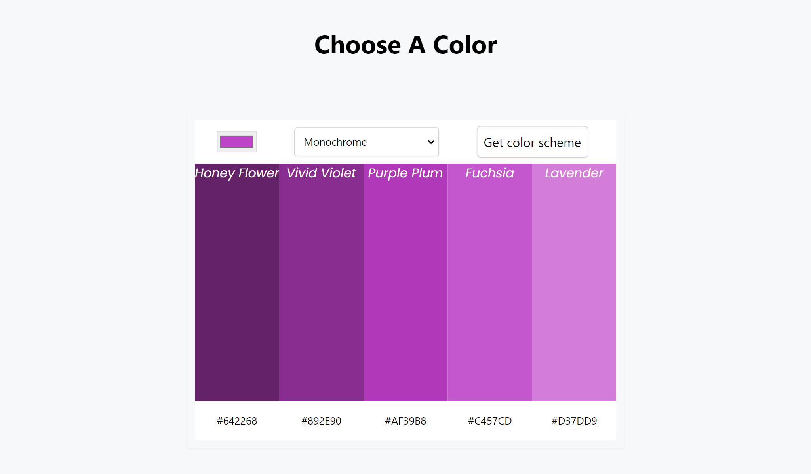

# Killy's color-scheme-generator

> An Api based web app to select color schemes from https://www.thecolorapi.com

## Live Demo

[Live Demo Link](https://killy10o10.github.io/color-scheme-generator/)

## Built With

- HTML
- CSS
- javascript

## Author

👤 **Okine Kingsley**

- GitHub: [@killy10o10](https://github.com/killy10o10)
- Twitter: [@Quami_Killy](https://twitter.com/Quami_Killy)
- Instagram: [quami_killy](https://www.instagram.com/quami_killy/)

## 🤝 Contributing

Contributions, issues, and feature requests are welcome!

## Show your support

Give a ⭐️ if you like this project!

## Acknowledgments

- Hat tip to anyone who's code/resource was used
